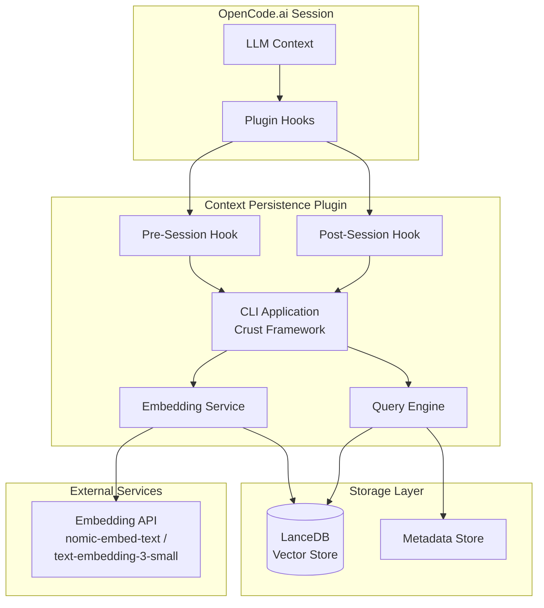
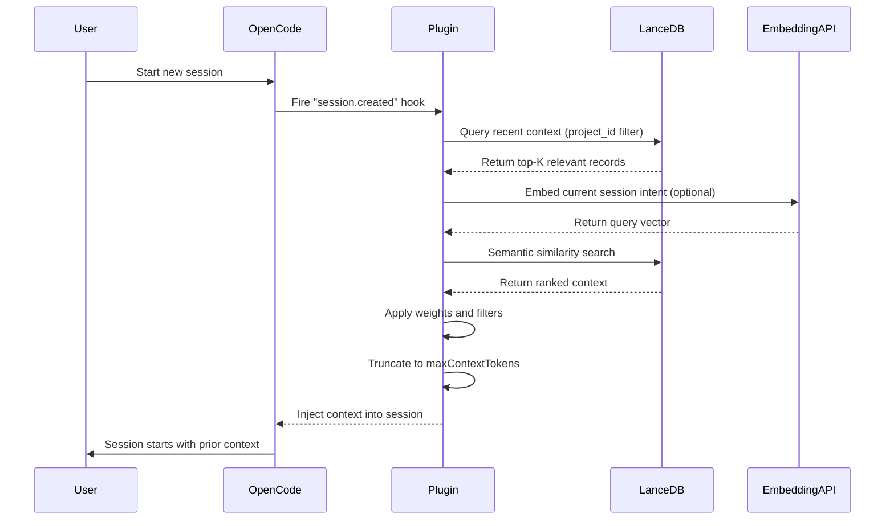
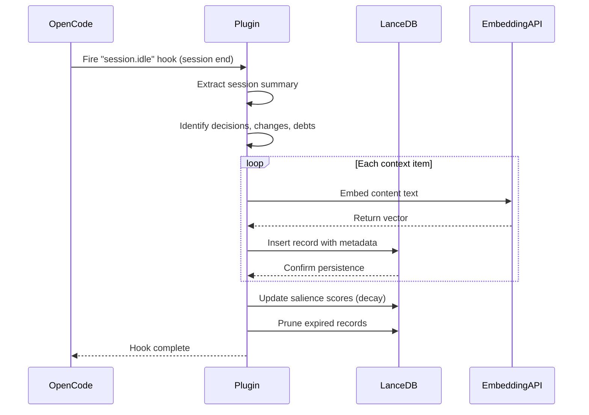
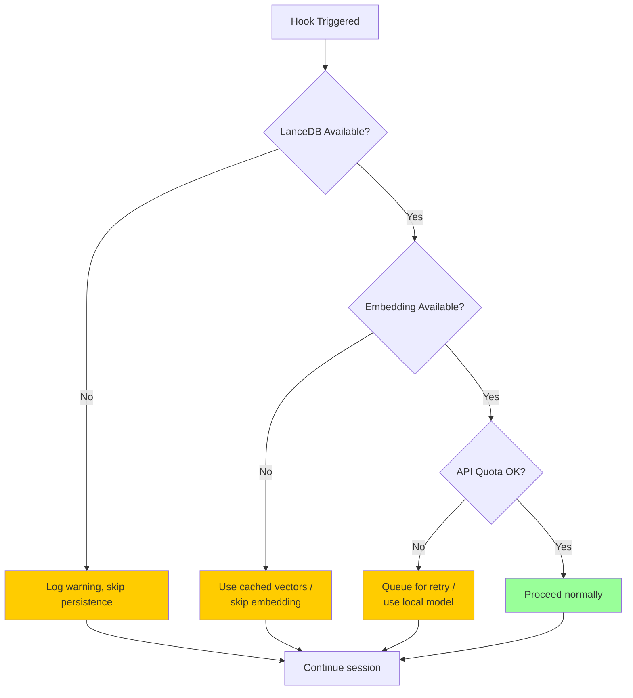

# Context Persistence Plugin Technical Specification

## Executive Summary

The Context Persistence Plugin enables LLMs to maintain semantic continuity across coding sessions by persisting and retrieving codebase context through a vector database. This system captures development decisions, code changes, architectural knowledge, and task progress during sessions, then injects relevant context when new sessions begin. The plugin integrates with OpenCode.ai's plugin architecture using session lifecycle hooks, stores embeddings in LanceDB, and provides a CLI interface for configuration and management.

---

## 1. Architecture Overview

### 1.1 System Diagram



### 1.2 Component Responsibilities

| Component | Technology | Responsibility |
|-----------|------------|----------------|
| CLI Host | Crust + Node.js | Plugin lifecycle, command parsing, configuration |
| Pre-Session Hook | OpenCode Plugin API | Context retrieval and injection |
| Post-Session Hook | OpenCode Plugin API | Context extraction and persistence |
| Vector Store | LanceDB | Semantic storage and retrieval |
| Embedding Service | Cloud/Local API | Text-to-vector conversion |

### 1.3 Deployment Topology

```
Project Root/
├── .lancedb/                    # Vector database (per-project)
├── .opencode/
│   └── plugins/
│       └── context-persistence/
│           ├── config.json      # Plugin configuration
│           └── cache/           # Local embedding cache
├── node_modules/
└── src/                         # User codebase
```

---

## 2. Data Schema

### 2.1 LanceDB Collection Structure

**Collection Name:** `codebase_context`

| Field | Type | Indexed | Description |
|-------|------|---------|-------------|
| `id` | UUID | Yes (Primary) | Unique record identifier |
| `vector` | Float[768] | Yes (IVF_PQ) | Embedding vector |
| `project_id` | String | Yes | Project identifier (SHA-256 of path) |
| `context_type` | Enum | Yes | Category: `file_change`, `decision`, `debt`, `task`, `architecture`, `command` |
| `content` | Text | No | Raw text content for embedding |
| `metadata` | JSON | No | Structured metadata (see below) |
| `session_id` | String | Yes | Source session identifier |
| `created_at` | Timestamp | Yes | Record creation time |
| `expires_at` | Timestamp | No | TTL for automatic pruning |
| `salience` | Float | Yes | Importance score (0.0-1.0) |

### 2.2 Metadata Schema by Context Type

```typescript
interface FileChangeMetadata {
  filePath: string;
  changeType: 'create' | 'modify' | 'delete';
  diffSummary: string;
  linesAdded: number;
  linesRemoved: number;
  relatedTasks: string[];
}

interface DecisionMetadata {
  decisionType: 'architecture' | 'library' | 'pattern' | 'refactor';
  rationale: string;
  alternatives: string[];
  stakeholders: string[];
  reversedAt?: Timestamp;
}

interface TechnicalDebtMetadata {
  debtType: 'performance' | 'security' | 'maintainability' | 'testing';
  severity: 'low' | 'medium' | 'high' | 'critical';
  introducedIn: string;  // session_id
  estimatedEffort: string;  // story points
  blockingRelease: boolean;
}

interface TaskMetadata {
  taskId: string;
  status: 'pending' | 'in_progress' | 'completed' | 'blocked';
  dependencies: string[];
  completedAt?: Timestamp;
  blockedReason?: string;
}

interface ArchitectureMetadata {
  component: string;
  layer: 'presentation' | 'business' | 'data' | 'infrastructure';
  relationships: string[];
  constraints: string[];
}

interface CommandMetadata {
  commandLine: string;
  exitCode: number;
  duration: number;  // milliseconds
  sideEffects: string[];
  workingDirectory: string;
}
```

### 2.3 Embedding Strategy

**Embedded Fields:**
- `content` (primary): Concatenated summary of changes, decisions, rationale
- `metadata.filePath` (for file changes): Relative path for semantic path queries
- `metadata.rationale` (for decisions): Decision reasoning text

**Stored as Metadata (Not Embedded):**
- All numeric fields (timestamps, counts, scores)
- Enumerations and status flags
- Binary identifiers (UUIDs, hashes)
- Large diff content (store summary only)

### 2.4 Index Configuration

```python
# LanceDB table creation
table = db.create_table(
    "codebase_context",
    schema=schema,
    mode="overwrite"
)

# Create vector index
table.create_index(
    metric_type="cosine",
    num_partitions=256,
    num_sub_vectors=96,
    vector_column="vector"
)

# Create scalar indexes
table.create_index("project_id")
table.create_index("context_type")
table.create_index("session_id")
table.create_index("created_at")
```

---

## 3. API Design

### 3.1 CLI Commands

```bash
# Initialize plugin in current project
context-persist init [--embedding-model <model>]

# Query stored context
context-persist query <text> [--limit <n>] [--type <type>]

# Show session history
context-persist history [--sessions <n>]

# Export context for backup
context-persist export [--output <path>]

# Import context from backup
context-persist import <path>

# Clear stored context
context-persist purge [--force]

# Show database statistics
context-persist stats

# Configure plugin
context-persist config set <key> <value>
context-persist config get <key>
context-persist config list
```

### 3.2 Plugin Hook Interface

```typescript
export const ContextPersistencePlugin = async ({ client, directory }) => {
  const db = await initLanceDB(directory)
  const embedder = createEmbedder(config.embeddingModel)
  
  return {
    // === READ PATH ===
    
    "session.created": async (input, output) => {
      const context = await queryRelevantContext(db, directory, embedder)
      if (context) {
        output.context.push(formatContextInjection(context))
      }
    },
    
    "experimental.session.compacting": async (input, output) => {
      const persistentContext = await getPersistentContext(db, directory)
      output.context.push(persistentContext)
    },
    
    // === WRITE PATH ===
    
    "session.idle": async (input, output) => {
      await persistSessionSummary(db, input.session, embedder)
    },
    
    "file.edited": async (input, output) => {
      await logFileChange(db, input.filePath, input.changes, embedder)
    },
    
    "command.executed": async (input, output) => {
      await logCommandExecution(db, input.command, output.result, embedder)
    },
    
    "tool.execute.after": async (input, output) => {
      await logToolExecution(db, input.tool, output.result, embedder)
    },
    
    "message.updated": async (input, output) => {
      if (isDecisionMessage(input.message)) {
        await logDecision(db, input.message, embedder)
      }
    },
    
    "todo.updated": async (input, output) => {
      await syncTaskState(db, input.todo, embedder)
    },
    
    "session.error": async (input, output) => {
      await logErrorState(db, input.error, input.session, embedder)
    },
  }
}
```

### 3.3 Configuration File Format

**Location:** `.opencode/plugins/context-persistence.json`

```json
{
  "enabled": true,
  "embeddingModel": "nomic-embed-text",
  "embeddingProvider": "cloud",
  "apiKey": "<optional>",
  "lancedbPath": ".lancedb",
  "maxContextTokens": 4096,
  "queryLatencyMs": 500,
  "salienceDecay": 0.95,
  "retentionDays": 90,
  "contextTypes": [
    "file_change",
    "decision",
    "debt",
    "task",
    "architecture",
    "command"
  ],
  "weights": {
    "file_change": 0.8,
    "decision": 1.0,
    "debt": 0.9,
    "task": 0.7,
    "architecture": 1.0,
    "command": 0.5
  },
  "filters": {
    "excludePatterns": [
      "**/node_modules/**",
      "**/dist/**",
      "**/build/**",
      "**/*.min.js",
      "**/.env*",
      "**/package-lock.json"
    ],
    "sensitiveDataRedaction": true
  }
}
```

---

## 4. Lifecycle Flow

### 4.1 Pre-Session Sequence Diagram



### 4.2 Post-Session Sequence Diagram



### 4.3 Error Recovery Flow



---

## 5. Context Taxonomy

### 5.1 Context Type Classification

| Type | Priority Weight | Retention | Description |
|------|-----------------|-----------|-------------|
| `decision` | 1.0 | 180 days | Architectural decisions, library choices, pattern selections |
| `architecture` | 1.0 | 365 days | Component relationships, system boundaries, API contracts |
| `debt` | 0.9 | Until resolved | Technical debt items, refactoring needs, known issues |
| `file_change` | 0.8 | 90 days | Significant file modifications, new files, deletions |
| `task` | 0.7 | 60 days | Task progress, blockers, completions |
| `command` | 0.5 | 30 days | Build commands, migrations, deployments |

### 5.2 Priority Scoring Algorithm

```python
def calculate_priority(record, query_vector):
    base_weight = WEIGHTS[record.context_type]
    
    # Semantic relevance (cosine similarity)
    relevance = cosine_similarity(record.vector, query_vector)
    
    # Recency decay (exponential)
    age_days = (now - record.created_at).days
    recency = config.salience_decay ** age_days
    
    # Manual salience boost
    salience = record.salience
    
    # Composite score
    score = base_weight * relevance * recency * salience
    
    return score
```

### 5.3 Retention Policies

| Policy | Action | Trigger |
|--------|--------|---------|
| TTL Expiry | Hard delete | `expires_at < now` |
| Salience Decay | Reduce priority | Daily batch job |
| Session Compaction | Merge related records | After 10 sessions |
| Project Archival | Compress to cold storage | 365 days inactive |

---

## 6. Retrieval Strategy

### 6.1 Query Patterns

```typescript
// Primary query: semantic similarity + filters
async function queryRelevantContext(db, projectDir, embedder, options) {
  const queryVector = await embedder.encode(options.intent || '')
  
  const results = await db.table('codebase_context')
    .search(queryVector)
    .filter(`project_id = '${projectHash}'`)
    .filter(`context_type IN (${options.types.join(',')})`)
    .filter(`created_at > ${options.since}`)
    .limit(options.limit || 50)
    .toVector()
  
  return applyWeightedRanking(results, options.weights)
}
```

### 6.2 Relevance Scoring

**Multi-Factor Ranking:**
1. **Cosine Similarity** (0.0-1.0): Vector distance to query
2. **Type Weight** (0.5-1.0): Context type priority
3. **Recency Score** (0.0-1.0): Exponential decay by age
4. **Manual Salience** (0.0-1.0): User/LLM-assigned importance

**Final Score:** `similarity × type_weight × recency × salience`

### 6.3 Context Window Management

```typescript
const MAX_CONTEXT_TOKENS = 4096  // Configurable

function truncateContext(records, maxTokens) {
  const sorted = sortByScore(records)
  const result = []
  let tokenCount = 0
  
  for (const record of sorted) {
    const tokens = countTokens(record.content)
    if (tokenCount + tokens <= maxTokens) {
      result.push(record)
      tokenCount += tokens
    }
  }
  
  return result
}
```

### 6.4 Deduplication Strategy

**Semantic Deduplication:**
- Compute pairwise cosine similarity
- Merge records with similarity > 0.95
- Keep most recent, preserve salience sum

**Exact Deduplication:**
- Hash `content + metadata.filePath`
- Skip insert if hash exists in last N sessions

---

## 7. Error Handling

### 7.1 Degradation Behavior

| Failure Mode | Degradation | Recovery |
|--------------|-------------|----------|
| LanceDB unavailable | Skip persistence, log warning | Retry on next hook |
| Embedding API timeout | Use cached vectors, skip new embeddings | Queue for batch retry |
| Rate limit exceeded | Switch to local model (if configured) | Exponential backoff |
| Database corruption | Create new DB, notify user | Restore from backup |
| Context query timeout | Return empty context, log metrics | Increase timeout limit |

### 7.2 Recovery Procedures

```typescript
async function handleEmbeddingFailure(record, embedder, cache) {
  // Attempt 1: Retry with backoff
  for (let i = 0; i < 3; i++) {
    try {
      return await embedder.encode(record.content, { timeout: 5000 })
    } catch (e) {
      await sleep(1000 * Math.pow(2, i))
    }
  }
  
  // Attempt 2: Use cached vector (if available)
  const cached = await cache.get(record.contentHash)
  if (cached) return cached
  
  // Attempt 3: Queue for batch processing
  await queueForBatchEmbedding(record)
  
  // Attempt 4: Local fallback model
  return await localEmbedder.encode(record.content)
}
```

### 7.3 Observability Requirements

**Metrics to Track:**
- Query latency (p50, p95, p99)
- Embedding API success rate
- Database size growth rate
- Context injection token count
- Deduplication ratio
- Cache hit rate

**Logging Format:**
```json
{
  "timestamp": "2025-01-19T10:30:00Z",
  "level": "info",
  "event": "context_injected",
  "sessionId": "abc123",
  "recordsCount": 15,
  "tokenCount": 3842,
  "queryLatencyMs": 234,
  "project": "llmngn.xyz"
}
```

---

## 8. Security Considerations

### 8.1 Data Isolation

**Project Isolation:**
- `project_id` derived from absolute path SHA-256
- All queries include `project_id` filter
- Separate LanceDB tables per project (optional)

**User Isolation:**
- Database stored in user home directory by default
- Per-user API key configuration

### 8.2 Access Controls

```typescript
// File permissions (Unix)
chmod 700 .lancedb/
chmod 600 .opencode/plugins/context-persistence.json

// Programmatic access check
function verifyProjectAccess(projectPath, userId) {
  const stat = fs.statSync(projectPath)
  return stat.uid === userId || stat.mode & 0o700
}
```

### 8.3 Sensitive Data Filtering

**Redaction Rules:**
```typescript
const REDACTION_PATTERNS = [
  /API_KEY=\S+/gi,
  /password:\s*\S+/gi,
  /secret:\s*\S+/gi,
  /Bearer\s+\S+/gi,
  /AWS_SECRET_ACCESS_KEY=\S+/gi,
]

function redactSensitiveData(content: string): string {
  return REDACTION_PATTERNS.reduce(
    (text, pattern) => text.replace(pattern, '[REDACTED]'),
    content
  )
}
```

**Excluded Files:**
- `.env*`, `*.pem`, `*.key`, `credentials.json`
- Files matching `config.excludePatterns`

### 8.4 Compliance Considerations

- No PII storage (personally identifiable information)
- GDPR right-to-deletion via `purge` command
- Audit log for data access (optional enterprise feature)
- Data residency: local-only storage (no cloud sync by default)

---

## 9. Performance Constraints

### 9.1 Latency Targets

| Operation | Target | Fallback |
|-----------|--------|----------|
| Context retrieval | < 500ms (p95) | 2000ms max |
| Session start blocking | < 2000ms | Async injection |
| Embedding API call | < 1000ms | Local model |
| Post-session persistence | < 5000ms | Background queue |

### 9.2 Storage Estimates

**Per Session:**
- Average context records: 10-20
- Vector size: 768 floats × 4 bytes = 3KB per record
- Metadata overhead: ~1KB per record
- **Total per session:** ~50-100KB

**Per 1000 Sessions:**
- **Estimated size:** 50-100MB
- **Growth rate:** ~50KB/session

### 9.3 Maximum Context Injection

| Setting | Default | Maximum |
|---------|---------|---------|
| Token limit | 4096 tokens | 8192 tokens |
| Record limit | 50 records | 200 records |
| Query timeout | 500ms | 2000ms |

---

## 10. Migration Path

### 10.1 Adoption Strategy for Existing Codebases

**Phase 1: Discovery (Session 1)**
- Initialize plugin, create empty database
- Log all session activity (write-only)
- No context injection yet

**Phase 2: Warming (Sessions 2-5)**
- Begin accumulating context
- Still no injection (building corpus)

**Phase 3: Active (Session 6+)**
- Enable full read-write cycle
- Inject relevant context from prior sessions
- Enable deduplication and compaction

### 10.2 Migration Commands

```bash
# Initialize for existing project
context-persist init --warmup-sessions 5

# Import context from another project
context-persist import --source ../other-project/.lancedb

# Dry-run: show what would be injected
context-persist query --dry-run --intent "refactor auth module"
```

---

## 11. Versioning Strategy

### 11.1 Schema Evolution

```typescript
// Schema version tracking
interface SchemaVersion {
  version: number;  // Increment on breaking changes
  migratedAt: Timestamp;
  migrationScript: string;
}

// Migration pattern
async function migrateSchema(db, fromVersion, toVersion) {
  const migrations = {
    1: addSalienceColumn,
    2: addExpirationTTL,
    3: extractProjectId,
  }
  
  for (let v = fromVersion + 1; v <= toVersion; v++) {
    await migrations[v](db)
    await recordMigration(db, v)
  }
}
```

### 11.2 Backward Compatibility

- Read old schema versions transparently
- Write in latest schema format
- Deprecation warnings for versions >2 major versions behind

---

## 12. Testing Strategy

### 12.1 Unit Tests

**Coverage Areas:**
- Embedding service mock
- LanceDB query builder
- Context weighting algorithm
- Deduplication logic
- Redaction filters

**Test Framework:** Vitest (aligned with project stack)

```typescript
describe('ContextPersistencePlugin', () => {
  it('injects prior session context on session.created', async () => {
    // Arrange
    const mockDB = createMockLanceDB()
    const plugin = createPlugin({ db: mockDB })
    
    // Act
    const output = await plugin['session.created']({ session: newSession }, { context: [] })
    
    // Assert
    expect(output.context).toHaveLength(1)
    expect(output.context[0]).toContain('prior session data')
  })
  
  it('persists file changes on file.edited', async () => {
    // Test implementation
  })
})
```

### 12.2 Integration Tests

**Test Scenarios:**
- Full session lifecycle (start → work → end)
- Context retrieval accuracy
- Database corruption recovery
- Embedding API failure handling

**Test Infrastructure:**
- Spin up real LanceDB instance
- Mock embedding API with recorded responses
- Use temporary test directories

### 12.3 End-to-End Tests

**E2E Flows:**
1. **Cold Start:** First session, no prior context
2. **Warm Start:** Session with prior context injection
3. **Multi-Session:** 5+ sessions, verify accumulation
4. **Cross-Project:** Verify project isolation
5. **Failure Recovery:** Kill DB, verify graceful degradation

**E2E Framework:** Playwright for CLI interaction

---

## 13. Non-Functional Requirements

### 13.1 Performance

- Context retrieval: < 500ms p95 latency
- Session start blocking: < 2 seconds maximum
- Support codebases with 10k+ files
- Batch embedding for post-session writes

### 13.2 Scalability

- Horizontal scaling: Multiple concurrent sessions via project isolation
- Partitioning: Separate LanceDB tables per project (auto)
- Connection pooling: Reuse LanceDB connections across hooks

### 13.3 Reliability

- Atomic writes: Transactional batch inserts
- Checkpoint/resume: Resume interrupted persistence
- Write-ahead log: Prevent partial corruption
- Health checks: Ping LanceDB on each hook

### 13.4 Usability

- Zero-config default: Works out-of-the-box
- CLI overrides: `--embedding-model`, `--max-tokens`, `--verbose`
- Progress indicators: Spinner for long operations
- Quiet mode: Suppress logs for production

---

## 14. Implementation Constraints

### 14.1 Technical Constraints

| Constraint | Rationale |
|------------|-----------|
| No OpenCode core modification | Plugin architecture only |
| Local LanceDB only | No cloud dependency requirement |
| Node.js 18+ minimum | Async/await, ESM support |
| Cross-platform (Win/Mac/Linux) | Electron/CLI compatibility |

### 14.2 Assumptions

| Assumption | Risk Mitigation |
|------------|-----------------|
| Network access for embedding API | Local fallback model (e.g., `@xenova/transformers`) |
| Sufficient disk space (~100MB/1000 sessions) | Automatic pruning, user warnings |
| OpenCode CLI in PATH | Installation script verification |
| Write permissions to project directory | Graceful degradation to user home |

---

## 15. Troubleshooting Guide

### 15.1 Common Issues

| Symptom | Probable Cause | Resolution |
|---------|----------------|------------|
| Context not injected | Empty database | Run 3-5 sessions to warm up |
| Slow session start | Large context query | Reduce `maxContextTokens` |
| Embedding failures | API key invalid | Check `config.apiKey` |
| Database corruption | Process killed mid-write | Run `context-persist init --force` |
| High memory usage | Large vector index | Reduce `num_partitions` in index |

### 15.2 Diagnostic Commands

```bash
# Check database health
context-persist stats --verbose

# Test embedding connectivity
context-persist config test-embedding

# View recent context
context-persist query "recent changes" --limit 10

# Export debug logs
context-persist logs --output debug.log
```

### 15.3 Support Escalation

1. Check logs: `.opencode/plugins/context-persistence.log`
2. Run diagnostics: `context-persist stats --verbose`
3. Export context: `context-persist export --output backup.zip`
4. File issue: https://github.com/llmngn.xyz/context-persistence-plugin/issues

---

## Acceptance Criteria Checklist

- [x] Define clear integration points with OpenCode's plugin API (Section 3.2)
- [x] Specify exact data structure for stored context with field types (Section 2.1-2.2)
- [x] Describe embedding model selection with justification (Section 1.1, 2.3)
- [x] Include performance constraints (Section 9)
  - Query latency target: < 500ms
  - Storage estimates: ~50-100KB/session
  - Max context injection: 4096 tokens default
- [x] Address incremental updates vs. full replacement (Section 4.2, 6.4)
- [x] Provide migration path for existing codebases (Section 10)
- [x] Include versioning strategy for schema evolution (Section 11)
- [x] Specify logging and observability requirements (Section 7.3)
- [x] Define testing strategy (Section 12)

---

## Version History

| Version | Date | Changes |
|---------|------|---------|
| 1.0 | 2025-01-19 | Initial specification |
| 1.1 | 2026-03-20 | Updated for current date, refined LanceDB schema |

---

**Specification Status:** Ready for Implementation

**Next Steps:** Generate `tasks.json` following TE9-Spec workflow to break this specification into test-driven development tasks.
